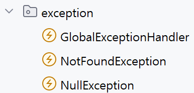

# 예외 처리란?
예외 처리는 코드 작성자가 예기치 않게 발생하는 오류들에 대응할 수 있도록 사전에 방지하는 것입니다.

# 예외처리를 하는 이유
예외를 발생시켜서 로그를 남기면 로그를 확인하고 문제가 발생한 원인을 빠르게 찾고 대응할 수 있습니다.

예를 들어 게시글마다 고유 id(**중복 X, 게시글을 식별하기 위한 값**)가 있고,
 어떤 id의 게시글을 찾을려고 할 때, 게시글이 존재한다면 게시글 정보가 응답이 됩니다.

그러나 만약 id에 해당하는 게시글이 존재하지 않거나, 다른 예외에서는 **상태 코드 500(서버 에러)이 응답으로 옵니다.**
 id에 해당하는 게시글이 존재하지 않고 서버는 null 처리를 하여 **NullException** 에러가 발생하여 500으로 응답이 오는겁니다.

심지어 이런 오류들은 원인도 없이 **"서버 오류임 수고"** 이런식으로 응답을 해서 어디에서 문제가 발생했는지 알기도 어렵습니다.

그런데 만약 id에 맞는 게시글이 존재하지 않을 때 **404 Not Found와 함께 에러 메시지를 전송한다면** 쉽게 어디 부분에서 문제가 발생했는지 개발자와 클라이언트 모두 알 수 있습니다.

# 장점
- 각 문제마다 예외 처리로 맞는 로그를 남겨서 문제 추적이 쉬움
- 사용자에게 의미 있는 문제 메시지와 상태 코드를 전달해서 어떤 문제인지 이해하기 쉽게 해줌
- 예외를 그대로 노출하면 서버 내부 구조, 클래스 이름, DB 정보 등이 외부에 드러나지만, 예외 처리를 통해 안전하게 정보 필터링 가능
- 예외가 발생해도 앱 전체가 중지되지 않고 안전하게 진행 가능

# 사용 방법

 주로 Exception(예외) 패키지에 예외들을 저장합니다.
 그리고 도메인 기반 구조 + 글로벌 공통 계층 구조를 사용할때는
 domain에는 해당 기능에서만 쓰이는 예외를,
 global에서는 전체적으로 쓰이는 예외를 저장합니다.

코드 작성
1. 원하는 예외에 맞는 클래스 생성

        public class NotFoundException extends RuntimeException {
            public NotFoundException(String message) {super(message);}
        }
2. Service에서 해당 클래스로 예외를 던져줍니다.

        ArticleEntity articleEntity = articleRepository.findById(id)
            .orElseThrow(() -> new NotFoundException("해당 아이디의 게시글이 존재하지 않습니다."));
**이때 서비스에서 예외가 발생한다면 다음에 작동할 서비스의 코드와 컨트롤러의 코드는 작동하지 않고 하던 작업을 중단합니다.**

3. GlobalExceptionHandler(관례처럼 사용)로 전역으로 예외 처리

        @RestControllerAdvice
            public class GlobalExceptionHandler extends RuntimeException {
            @ExceptionHandler(NotFoundException.class)
            public ResponseEntity<Map<String, String>> handleNotFoundException(NotFoundException e) {
                Map<String, String> map = new HashMap<>();
                map.put("error", e.getMessage());
                return ResponseEntity.status(HttpStatus.NOT_FOUND).body(map);
            }
        }
@ExceptionHandler(NotFoundException.class)를 사용해서 해당 예외 처리 클래스가 작동할 때 아래 메서드가 작동합니다.