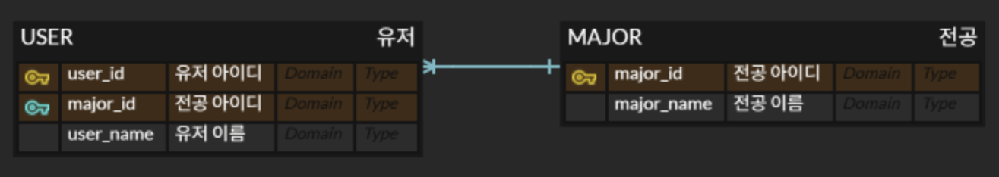

# FetchType
Fetch ype이란 JPA(Java Persistence API)에서 연관된 엔티티를 어떻게 가져올지(데이터베이스에서 언제 로딩할지) 설정하는 방식입니다.

enum 타입이며 아래와 같이 두 가지 종류가 있습니다.
1. LAZY (지연 로딩)
 연관된 엔티티를 실제로 사용할 때까지 데이터베이스에서 조회를 하지 않아서 성능 최적화에 유리합니다.
2. EAGER (즉시 로딩)
 연관된 엔티티를 조회 시 JOIN 등으로 즉시 함께 조회합니다.

## 연관 어노테이션
- `@ManyToOne`, `@OneToOne`의 기본값은 FetchType.EAGER(즉시 로딩) 입니다.
- `@OneToMany`, `ManyToMany`의 기본값은 FetchType.LAZY(지연 로딩) 이여서 즉시 로딩을 사용할 때 EAGER 타입으로 변경해주어야 합니다.

## 사용 예시 (Entity)
    @Entity
    @Getter
    public class Member {
        @Id
        private Long id;
        
        @ManyToOne(fetch = FetchType.LAZY)
        private Major majorId;
    }
Member가 Major와 `@ManyToOne` 관계를 맺고 있고, FetchType이 LAZY로 설정이 되어있어서 `member.getMajorId()`를 호출하기 전까지는 Major 엔티티를 조회하지 않습니다.

## 동작 과정
ex) 위 예시에서 `member.getMajorId()`를 통해 Major 엔티티를 조회할려는 상황

### LAZY
    // getMajorId를 쓰기 전 member.findById(1) 사용
    SELECT * FROM member WHERE id = 1;

    // getMajorId 사용
    SELECT * FROM major WHERE id = ?;
### EAGER
    // member.findById(1) 사용
    SELECT m.*, a.*
    FROM member m
    LEFT OUTER JOIN team a ON m.major.id = a.id
    WHERE m.id = 1;

# N+1 문제
N+1 문제란, 연관 관계가 설정된 엔티티를 조회할 경우에 조회된 데이터 갯수(N)만큼 연관관계의 조회 쿼리가 추가로 발생하여 데이터를 읽어오는 문제입니다.

## 예시
아래와 같은 데이터베이스 구조가 있습니다.

### EAGER(즉시 로딩을 한 경우)
    @Entity
    public class User {
        @Id
        @GeneratedValue
        private long id;
        private String user_name;

        @ManyToOne(fetch = FetchType.EAGER) // 즉시 로딩
        @JoinColumn(name = "major_id", nullable = false)
        private Major major;
    }
 

    @Entity
    public class Major {
        @Id
        @GeneratedValue
        private long id;
        private String name;

        @OneToMany(fetch = FetchType.EAGER)
        private List<User> users = new ArrayList<>();
    }
### JpaRepository 사용
    List<User> users = userRepository.findAll();

    System.out.println("// findAll 후");

    for (User user : users) {
        System.out.println(user.getUser_name());
        System.out.println(user.getMajor().getName());
    }
### Hibernate가 실행하는 SQL 전체
userRepository.findAll()만 했을 때

    select
        user0_.id as id1_1_,
        user0_.user_name as user_nam2_1_,
        user0_.major_id as major_id3_1_
    from
        user user0_;
getMajor().getName()을 했을 때

    // 첫번째 User의 Major 로딩
    select
        major0_.id as id1_0_0_,
        major0_.name as name2_0_0_
    from
        major major0_
    where
        major0_.id=?;

    // 두번째 User의 Major 로딩
    select
        major0_.id as id1_0_0_,
        major0_.name as name2_0_0_
    from
        major major0_
    where
        major0_.id=?;
이런식으로 findAll()에서는 User만 로딩되고, Major는 로딩할때마다 즉시 SELECT를 실행합니다.
 즉, SQL 쿼리의 수가
처음 User 조회 : **1회**
 각 User의 Major 조회 : **N회 (유저의 수만큼)**
 = 1+N가 됩니다.

### EAGER 의문점
여기서 EAGER는 **즉시 로딩인데, 왜 미리 안 불러오고 나중에 쿼리를 실행하는가?** 라는 의문이 생겼습니다.

EAGER는 조회할 때 같이 불러오도록 의도한다는 정책일 뿐이고,
 어떻게 불러올지는 JPA 구현체(Hibernate)가 결정합니다.

Hibernate는 **성능, 복잡도, 메모리, 정합성 등을 고려**해서 EAGER라도 무조건 JOIN하지 않고 연관 객체를 개별 SELECT로 필요할 때 가져오는 방식을 사용합니다.

### LAZY(지연 로딩을 한 경우)
위에서 FetchType.EAGER를 FetchType.LAZY로 전부 변경하면,
 LAZY 자체에는 문제가 없지만 EAGER를 사용했던 것과 똑같이 **사용 시점에 쿼리를 발생시키기 때문에** N+1 문제가 발생하게 됩니다.

즉, LAZY는 연관 엔티티를 필요할 때 가져오지만,
 그게 반복이 된다면 N+1 문제가 발생하게 됩니다.

## N+1 해결 방법
### FETCH JOIN
FETCH JOIN을 이용해서 한번에 JOIN을 해서 가져오면 **쿼리 1회로 모든 데이터를 조회**해서 추가 쿼리가 발생하지 않아 N+1 문제가 해결됩니다.

    @Query("SELECT u FROM User u JOIN FETCH u.major")
    List<User> findAllWithMajor();
장점
- 불필요한 다중 쿼리(N+1)을 막고, 데이터베이스 접근 횟수를 줄입니다.
- 반복 조회 로직을 제거해서 코드가 단순해집니다

단점
- `@OneToMany`에 FETCH JOIN을 할 시, List에 중복 객체가 생길 수 있습니다.
- FETCH JOIN을 하면 내부적으로 Limit/Offest을 적용할 수 없어서 페이징 처리가 불가능합니다.
- 연관 관계가 많거나 깊으면 JOIN 수가 많아지고, 쿼리가 무거워집니다.
### EntityGraph
EntityGraph는 JPQL이나 메서드 이름 기반 쿼리를 사용할 때, 연관 엔티티를 미리 로딩하도록 설정 가능하게 만듭니다.
 즉, FETCH JOIN 없이도 EAGER처럼 연관 객체가 로딩되게 합니다.

    @EntityGraph(attributePaths = {"major"})
    List<User> findAll();
장점
- FETCH JOIN처럼 N+1 문제를 해결할 수 있습니다.
- FETCH JOIN은 쿼리에 박혀있어서 재사용이 어렵지만, `@EntityGraph`는 쿼리는 그대로 두고 fetch 전략만 바꿔서 유연하게 사용이 가능합니다.
- 어느 필드를 로딩할지 명시적으로 적음으로서 코드의 가독성을 향상시키고 유지보수에 유리해집니다.
- FETCH JOIN과 다르게 페이징 처리에 사용이 가능합니다.

단점
- JOIN 타입이나 조건을 직접 지정할 수 없습니다.
- `@OneToMany`를 FETCH하면 중복 데이터가 발생할 수 있습니다.
