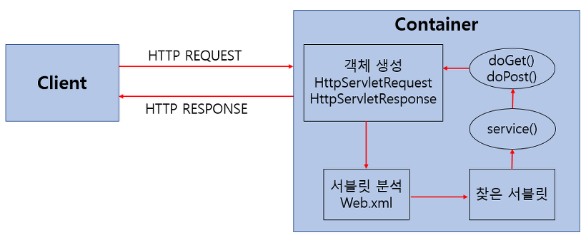

# Servlet
Servlet이란 클라이언트(브라우저)가 웹 서버에 요청을 보내면, 그 요청을 받아서 처리하고, HTML이나 JSON 같은 응답을 만들어서 보내주는 자바 프로그램입니다.

예를 들어 사용자가 로그인을 하려 할 때, 아이디와 비밀번호를 입력하고 로그인 버튼을 누르면 클라이언트는 서버로 해당 정보를 전송합니다.

서버는 이 요청을 받아 아이디와 비밀번호를 검증하고, 그 결과에 따라 다음 페이지로 이동시키거나 오류 메시지를 보여줍니다.

이처럼 사용자의 요청을 받아 처리하고 응답을 생성하는 역할을 하는 것이 바로 Servlet입니다.
## 왜 만들어졌을까?
과거엔 웹 페이지를 만들 때 HTML만으로는 동적인 웹 페이지를 만들 수 없었고, 사용자의 입력을 처리하거나 데이터베이스와 연결하는 기능이 필요했습니다.

이를 위해 자바로 백엔드 코드를 작성할 수 있는 방법으로 Servlet 기술이 나왔습니다.
## Servlet 동작 방식

사용자(클라이언트)가 URL을 입력하면 HTTP Request가 Servlet Container로 전송합니다.

요청을 전송받은 Servlet Container는 HttpServletRequest, HttpServletResponse 객체를 생성합니다.

web.xml을 기반으로 사용자가 요청한 URL이 어느 서블릿에 대한 요청인지 찾습니다.

해당 서블릿에서 service메소드를 호출한 후 클리아언트의 GET, POST여부에 따라 doGet() 또는 doPost()를 호출합니다.

doGet() or doPost() 메소드는 동적 페이지를 생성한 후 HttpServletResponse객체에 응답을 보냅니다.

응답이 끝나면 HttpServletRequest, HttpServletResponse 두 객체를 소멸시킵니다.

## Servlet VS Spring MVC의 Controller

        // Servlet을 이용한 예시
        @WebServlet("/hello")
        public class HelloServlet extends HttpServlet {

            @Override
            protected void doGet(HttpServletRequest req, HttpServletResponse resp)
                throws ServletException, IOException {

                resp.setContentType("text/plain");
                resp.getWriter().write("Hello, Servlet!");
            }
        }

        // Spring MVC의 Controller를 사용한 예시
        @RestController
        public class HelloController {

            @GetMapping("/hello")
            public String hello() {
                return "Hello, Servlet!";
            }
        }
1. Controller는 자동 매핑, 바인딩을 통해 코드가 간결하지만, Servlet은 코드가 복잡합니다.

2. Controller는 Spring 프레임워크에 의존성이 있지만, Servlet은 Spring 없이도 사용이 가능해 의존성이 없습니다.

3. Controller는 간결하고 유연한 확장성으로 유지보수와 테스트에 용이하지만, Servlet은 코드가 복잡하여 유지보수와 확장성이 낮습니다.

# Dispatcher Servlet
DispatcherServlet란 Spring 프레임워크의 핵심 구성 요소 중 하나로, Spring MVC 아키텍처에서 요청을 처리하고 적절한 컴포넌트로 전달하는 역할을 하는 프론트 컨트롤러(Front Controller) 입니다.

## Dispatcher Servlet 역할
###클라이언트 요청 수신
웹 브라우저나 클라이언트가 보낸 HTTP 요청을 가장 먼저 받는 서블릿입니다.
### 요청 분석 및 라우팅
요청 URL, 메서드(GET/POST 등) 등을 분석하여 어떤 컨트롤러가 처리해야 할지 판단합니다
### 적절한 컨트롤러에 전달
@Controller 혹은 @RestController에 정의된 메서드를 찾아 호출합니다
### 응답 처리 및 뷰 반환
컨트롤러가 반환한 결과를 받아서, 뷰 이름이면 ViewResolver를 통해 JSP 또는 템플릿을 렌더링하고, REST API라면 JSON으로 변환해 응답을 보냅니다.
## Dispatcher Servlet 등록
Spring Boot에서는 자동으로 등록됩니다. (자동으로 / 경로에 매핑된 DispatcherServlet이 등록되어 모든 요청을 가로챕니다)

하지만 전통적인 방식에서는 아래 코드처럼 web.xml이나 Java Config에 등록해야 했습니다.

        <servlet>
            <servlet-name>dispatcher</servlet-name>
            <servlet-class>org.springframework.web.servlet.DispatcherServlet</servlet-class>
        </servlet>

        <servlet-mapping>
            <servlet-name>dispatcher</servlet-name>
            <url-pattern>/</url-pattern>
        </servlet-mapping>