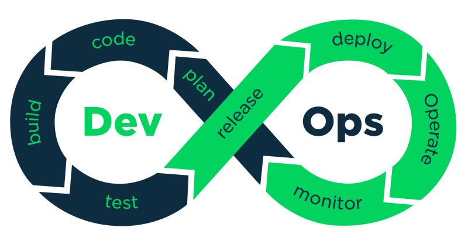

# DevOps란?

Development(개발) + Operations(운영)의 합성어로 다음과 같은 목표를 가집니다.
- 개발팀과 운영팀이 협업해 빠르고 안정적인 배포
- 수동 업무를 자동화해 오류를 줄이고 효율 극대화
- 서비스의 품질과 배포 빈도 향상

## DevOps의 역할
    코드 -> 빌드 -> 테스트 -> 배포 -> 운영 -> 피드백
전 과정을 책임이며, 서비스의 안정성과 속도를 동시에 확보합니다.

### 자동배포 CICD 구축
코드를 푸시하면 자동으로 빌드&테스트&배포가 되도록 파이프라인을 설정합니다.
### 보안 자동화
개발&배포 단계에서 보안 검사 자동화를 합니다.
### 모니터링
서비스가 잘 돌아가는지 실시간으로 확인하고 문제가 생기면 알려줍니다.

## DevOps의 좋은 점
자동화로 인해서 하루에도 여러번 업데이트가 가능해져서 배포 속도가 빨라지고, 사람 실수가 줄어듭니다.