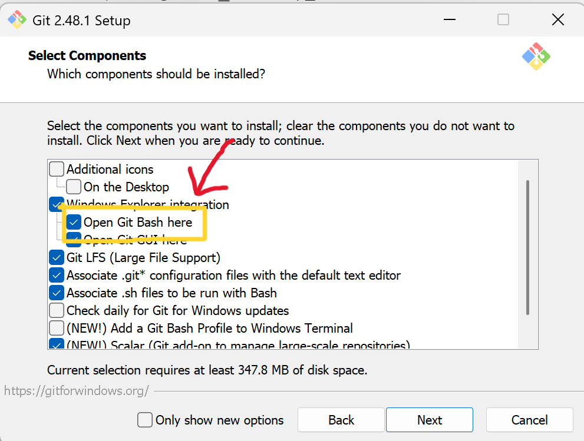

# Git에 대해
#### 이 마크다운은 Git에 대해 공부한 내용을 정리하고자 작성되었습니다.

참고한 벨로그, 사이트들
 
[벨로그](https://velog.io/@simchodi/Git-%EC%B4%88%EA%B8%B0%EC%84%B8%ED%8C%85-%EA%B8%B0%EB%B3%B8%EB%AA%85%EB%A0%81%EC%96%B4)
 
[김선규](https://seonkyukim.github.io/git-tutorial/git-status/)

## 버전 관리 시스템
버전 관리 시스템은 파일들의 변화를 시간별로 기록을 하기 때문에 **특정 시점의 버전을 다시 꺼내올수 있는 시스템입니다.**

그래서 다음과 같은 장점들이 있습니다.
- 버전들을 저장하므로 파일을 다시 되돌릴 수 있습니다.

- 언제 누가 저장했는지 볼 수 있으므로 누가 잘못했는지 알 수 있습니다.

- 버전에 따라서 뭐가 수정됐는지 확인이 가능합니다.

이 **버전 관리 시스템**은 Git에 사용됩니다.

## Git과 GitHub의 차이점
Git은 소프트웨어 개발 과정에서 소스 코드를 관리하는 버전 관리 시스템 소프트웨어고, GitHub는 레포지토리를 통해 프로젝트를 사람들과 협업 또는 공유하기 위해 사용합니다.

## Git의 장점
- 누군가 동시에 프로젝트를 업로드해도 **겹쳐서 마지막에 올린것을 제외한 나머지들이 덮어 씌워지는게 아니라** 전부 기록에 남아서 덮어 씌워져서 날라가는 그런 일은 없습니다.
- 위와 같은 이유 덕분에 같은 환경에서 개발하며 시간을 단축하면서, 서로 충돌을 없애줍니다.

## Git 파일들의 상태

Git 파일 상태에는 총 4가지가 존재합니다.
Untracked, Unmodified, Modified, Staged
해당 상태들에 대해서는 아래에서 Git의 명령어를 설명하면서 다시 설명하도록 하겠습니다

## Git 설치법
https://git-scm.com/ < 이 사이트에서 Git을 다운받습니다.
 
Git을 다운받으시고 실행하시면 설치 하기전 다음 창이 뜰껍니다.

**여기서 Open Git Bash here을 체크해주시면 되겠습니다.** 

## Git 기본 명령어들

GitHub 레포지토리와 연동을 하실 폴더에 들어가셔서 **Shift+우클릭**을 하시면 이와 같이 뜨실텐데, 여기서 **Open Git Bash here**를 눌러주세요. (해당 폴더를 디렉토리로 설정이 된 채로 Git Bash가 열립니다.)

이제 cmd 창이 뜨셨을껍니다.
여기서 **git --version**을 치고 엔터를 누르시면 자신의 git의 버전이 나옵니다.

### 기본 설정 명령어들
    git config --global user.name "쓰실 이름"
    git config --global user.email "이메일"
    / 본인의 컴퓨터에 Git에 쓰이는 이름을 설정합니다.
    / 깃허브와 통일하는것을 추천합니다.
 

    git config --global user.name
    git config --global user.email
    / 본인이 설정한 이름과 이메일을 볼 수 있습니다.
 

    git config --global init.defaultBranch main
    / 브랜치(branch)라는 것이 있는데, 이것의 기본 이름은 원래 master지만 논란이 좀 있어서 main으로 변경을 시켜줍니다.
 

    git init
    / 아까 Open Git Bash Here을 눌러서 열었던 디렉토리(폴더)를 기준으로 Git 저장소를 생성합니다. (필수!)
### Git 명령어들
    git status
    / 현재 디렉토리에 있는 파일들의 상태를 확인합니다.
 
    
    git add (파일명) 또는 .
    / 파일명을 입력해서 파일 하나만 add 하거나, .을 적어서 파일 전체를 add 할 수 있습니다.
    / 파일을 add 하면 git이 감지를 못하는 Untracted 공간에서 Staged 공간으로 올라오게 됩니다.
 

    git commit -m "커밋 메시지"
    / Staged 공간에 있는(add로 옮겨진) 파일들이 Unmodified 공간으로 내려옵니다
 

    git log / 커밋 내역을 보여줍니다.
    git log --oneline / 커밋 내역을 한줄씩 보여줍니다.
    git log --graph / 커밋 내역을 시각화해서 보여줍니다.
    git log --branches / 각 브랜치의 커밋내역을 보여줍니다.
 

    git remote add origin (원격 주소)
    / 해당 디렉토리의 원격 저장소(GitHub)를 설정한다.
    / Git에서는 Ctrl+V가 아닌 Shift+Insert로 붙여넣기를 합니다.
    / git remote -v로 연결이 잘 됐는지 확인이 가능합니다.

    git push
    / commit이 된 파일들을 원격 저장소로 업로드합니다.
    / 최대 용량 25MB

## 브랜치에 대해서
    