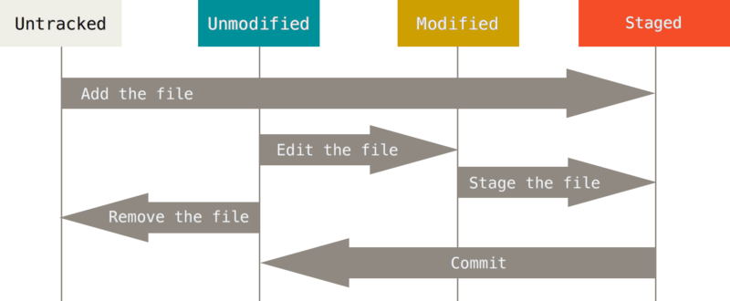

# Git에 대해
#### 이 마크다운은 Git에 대해 공부한 내용을 정리하고자 작성되었습니다.
#### Git에 대해 다 적을려고 하다보니 너무 길어진거 같습니다.
#### 다음부터는 좀 더 간결하게 작성하도록 하겠습니다 ㅠㅠ
참고한 벨로그, 사이트들
 
[벨로그](https://velog.io/@simchodi/Git-%EC%B4%88%EA%B8%B0%EC%84%B8%ED%8C%85-%EA%B8%B0%EB%B3%B8%EB%AA%85%EB%A0%81%EC%96%B4)
 
[김선규](https://seonkyukim.github.io/git-tutorial/git-status/)
 
[벨로그2](https://velog.io/@bcl0206/Branch%EC%99%80-Merge%EC%9D%98-%EA%B0%9C%EB%85%90%EA%B3%BC-%EC%88%9C%EC%84%9C)
 
[벨로그3](https://velog.io/@gwsyl22/git-branch-%EC%83%9D%EC%84%B1%EA%B3%BC-%EC%B2%B4%ED%81%AC%EC%95%84%EC%9B%83)
 
[티스토리](https://holika.tistory.com/entry/Git-삽질기록-PR을-올리다-Pull-Request에-대해서)
 
[벨로그4](https://velog.io/@chwogus/Git-%EC%BD%94%EB%93%9C%EB%A6%AC%EB%B7%B0-%ED%95%98%EB%8A%94-%EB%B0%A9%EB%B2%95#%EC%BD%94%EB%93%9C%EB%A6%AC%EB%B7%B0%EA%B0%80-%EC%A4%91%EC%9A%94%ED%95%9C-%EC%9D%B4%EC%9C%A0)
 
[벨로그5](https://velog.io/@myoungji-kim/git-flow)
 
[벨로그6](https://velog.io/@myoungji-kim/git-flow)

## 버전 관리 시스템
버전 관리 시스템은 파일들의 변화를 시간별로 기록을 하기 때문에 **특정 시점의 버전을 다시 꺼내올수 있는 시스템입니다.**

그래서 다음과 같은 장점들이 있습니다.
- 버전들을 저장하므로 파일을 다시 되돌릴 수 있습니다.

- 언제 누가 저장했는지 볼 수 있으므로 누가 잘못했는지 알 수 있습니다.

- 버전에 따라서 뭐가 수정됐는지 확인이 가능합니다.

이 **버전 관리 시스템**은 Git에 사용됩니다.

## Git과 GitHub의 차이점
Git은 소프트웨어 개발 과정에서 소스 코드를 관리하는 버전 관리 시스템 소프트웨어고, GitHub는 레포지토리를 통해 프로젝트를 사람들과 협업 또는 공유하기 위해 사용합니다.

## Git의 장점
- 누군가 동시에 프로젝트를 업로드해도 **겹쳐서 마지막에 올린것을 제외한 나머지들이 덮어 씌워지는게 아니라** 전부 기록에 남아서 덮어 씌워져서 날라가는 그런 일은 없습니다.
- 위와 같은 이유 덕분에 같은 환경에서 개발하며 시간을 단축하면서, 서로 충돌을 없애줍니다.

## Git 파일들의 상태

Git 파일 상태에는 총 4가지가 존재합니다.
Untracked, Unmodified, Modified, Staged
해당 상태들에 대해서는 아래에서 Git의 명령어를 설명하면서 다시 설명하도록 하겠습니다

## Git 설치법
https://git-scm.com/ < 이 사이트에서 Git을 다운받습니다.
 
Git을 다운받으시고 실행하시면 설치 하기전 다음 창이 뜰껍니다.

**여기서 Open Git Bash here을 체크해주시면 되겠습니다.** 

## Git 기본 명령어들

GitHub 레포지토리와 연동을 하실 폴더에 들어가셔서 **Shift+우클릭**을 하시면 이와 같이 뜨실텐데, 여기서 **Open Git Bash here**를 눌러주세요. (해당 폴더를 디렉토리로 설정이 된 채로 Git Bash가 열립니다.)

이제 cmd 창이 뜨셨을껍니다.
여기서 **git --version**을 치고 엔터를 누르시면 자신의 git의 버전이 나옵니다.

### 기본 설정 명령어들
    git config --global user.name "쓰실 이름"
    git config --global user.email "이메일"
    / 본인의 컴퓨터에 Git에 쓰이는 이름을 설정합니다.
    / 깃허브와 통일하는것을 추천합니다.
 

    git config --global user.name
    git config --global user.email
    / 본인이 설정한 이름과 이메일을 볼 수 있습니다.
 

    git config --global init.defaultBranch main
    / 브랜치(branch)라는 것이 있는데, 이것의 기본 이름은 원래 master지만 논란이 좀 있어서 main으로 변경을 시켜줍니다.
 

    git init
    / 아까 Open Git Bash Here을 눌러서 열었던 디렉토리(폴더)를 기준으로 Git 저장소를 생성합니다. (필수!)
### Git 명령어들
    git status
    / 현재 디렉토리에 있는 파일들의 상태를 확인합니다.
 
    
    git add (파일명) 또는 .
    / 파일명을 입력해서 파일 하나만 add 하거나, .을 적어서 파일 전체를 add 할 수 있습니다.
    / 파일을 add 하면 git이 감지를 못하는 Untracted 공간에서 Staged 공간으로 올라오게 됩니다.
 

    git commit -m "커밋 메시지"
    / Staged 공간에 있는(add로 옮겨진) 파일들이 Unmodified 공간으로 내려옵니다
 

    git log / 커밋 내역을 보여줍니다.
    git log --oneline / 커밋 내역을 한줄씩 보여줍니다.
    git log --graph / 커밋 내역을 시각화해서 보여줍니다.
    git log --branches / 각 브랜치의 커밋내역을 보여줍니다.
 

    git remote add origin (원격 주소)
    / 해당 디렉토리의 원격 저장소(GitHub)를 설정한다.
    / Git에서는 Ctrl+V가 아닌 Shift+Insert로 붙여넣기를 합니다.
    / git remote -v로 연결이 잘 됐는지 확인이 가능합니다.

    git push
    / commit이 된 파일들을 원격 저장소로 업로드합니다.
    / 최대 용량 25MB

## 브랜치에 대해서
### 브랜치 Branch
브랜치(Branch)는 소스 코드를 분리하여 관리하는 개념입니다.

예를 들어 master와 main이라는 이름을 가진 브랜치가 있다면, master 브랜치에서 아무리 수정을 하고 push를 해도 main에는 영향이 안가 안전합니다.
 
그리고 다른 사람과 함께 동시에 작업을 하고 있어도, 서로 사용하는 브랜치가 다르다면 충돌 위험이 없으니 더욱 더 좋죠 👍

    git branch / 현재 브랜치 상태를 볼 수 있습니다.
    git branch "브랜치 이름" / 해당 이름의 브랜치를 생성합니다.
    git branch -D "브랜치 이름" / 해당 이름의 브랜치를 삭제합니다.
    git branch -m "바꾸고 싶은 브랜치의 이름" "바꾸고 싶은 이름"
 

### Branch checkout

    git checkout "변경하고 싶은 브랜치의 이름" / 현재 작업하고 있는 브랜치를 해당 이름의 브랜치로 변경한다.
    git checkout -b "브랜치 이름" / 새로운 브렌치를 생성하고 현재 작업하고 있는 브랜치를 해당 이름의 브랜치로 변경한다.

아 그리고 **git switch**도 현재 작업하고 있는 브랜치를 변경하는거니 참고 바랍니다!
- git checkout 브랜치 이름 = git switch 브랜치 이름
- git checkout -b 브랜치 이름 = git switch -c 브랜치 이름

브랜치만 다룬다면 switch를 쓰는것이 깔끔하고 좋지만, 아니라면 checkout을 쓰는것을 추천합니다. **(checkout은 다양한 역할때문에 사용 주의)**

### Branch Merge

서로 다른 사람이 동시에 개발을 하기 위해 원래 브랜치에서 브랜치를 하나를 더 생성해 나눴다고 가정해봅시다.
그러면 개발이 완료가 된다면 원래 사용하던 브랜치로 합쳐줘야하고, 그 기능을 하는 것이 merge입니다.

    git switch를 이용하여 브랜치를 이동합니다.
    그리고 git merge "브랜치 이름"을 사용하여 해당 브랜치를 아까 git switch로 이동한 브랜치로 합칩니다.
그런데 가끔 충돌(conflict)이 일어날때가 있습니다.
바로 **같은 파일의 같은 부분을 두 브랜치에서 다르게 수정했을때** 생깁니다.
이때 직접 파일을 열어서 원하는 내용을 선택하거나 조합해서 수정을 하면 됩니다.
 
(VS Code, GitKraken, Sourcetree 등 GUI 프로그램들은 충돌 해결 UI를 제공해줘서 훨씬 고치기 편합니다!)

## GitHub를 이용한 협업의 기본
### 협업 초기 세팅 (팀장)
1. 브랜치를 생성하고 해당 브랜치를 default로 설정합니다.
 
( GitHub에서 Settings -> Default Branch )
 
( 해당 브랜치에서 git clone 또는 pull로 파일을 복사해옵니다. )
2. GitHub에서 Settings -> Collaborators -> Add People을 눌러서 자신의 프로젝트에 팀원들을 초대합니다.
### 협업 초기 세팅 (팀원)
1. 본인이 같이 프로젝트를 진행할 빈 폴더를 생성합니다.
2. 아래와 같이 명령어를 적어서 해당 레포지토리를 복사해옵니다.

        git clone 레포지토리의 주소 .
        // 해당 레포지토리의 파일들을 복사해옵니다.
### Pull Request
Pull Request를 한마디로 하면
 
'서버에 업데이트되어 있는 내용을 받아와 주세요' 라고 할 수 있겠다.

Pull Request를 할때 보면

    base branch <- head branch
라고 되어있을 것입니다. 이거는 오른쪽에 있는 브랜치에서 왼쪽에 있는 브랜치로 Pull 요청을 보낸다는 뜻입니다.
 
그 밑에 Able to merge 또는 cannot merge라는 메세지가 있으실텐데,
**Able to merge**는 Pull request가 받아들여질때 크래시가 나지 않고 잘 적용이 될꺼 같다는 뜻이고, **Cannot Merge**는 말 그대로입니다.

여러 변화(commit)가 있었고 어떤 이유로든 깃이 그걸 무사히 merge하지 못할 정도라면 빨간색으로 **cannot merge.**라는 메시지가 뜬다.

**cannot merge**가 뜨더라도 PR을 보내는 쪽은 문제가 없지만,
**받는 쪽에서 크래시를 해결해야 하는 불편함이 있습니다**

### 코드 리뷰
**다른 사람의 코드를 보고 어디를 고치면 좋을지 피드백을 해주는 과정 중 하나입니다**
 
PR 화면에서 다음과 같이 뜨실껍니다.

Reviewers : 현재 Pull Request(PR)을 리뷰를 해 줄 팀원 지정
 
Assignees : 현재 Pull Request(PR) 작업의 담당자 지정

Reviewer를 지정해주시면 해당 사람에게 메일로 알림이 갑니다.

리뷰가 필요하거나, 궁금한 코드가 있는 줄에 마우스를 가져가보면 + 버튼을 볼 수 있고, 그것을 클릭하면 리뷰를 작성할 공간이 생깁니다.

- Approve : Merge해도 괜찮을꺼 같다는 의견을 보내는 것입니다.
- Request changes : 승인을 거부하고 변경을 요청하는 것입니다.
- Comment : 일반적인 피드백을 하고싶을때 선택합니다.

## Git Flow
브랜치를 체계적으로 나눠서 협업이 쉬워지고 안정성 있게 배포할 수 있게 해주는 버전 관리 전략을 말합니다.

사진과 함께 설명을 하겠습니다

- main
 
실제 운영에 반영되어 있는 소스 코드들이 있는 브랜치
- release
1. 베타 배포 및 베타 QA를 위한 브랜치
2. main 배포 예정인 feature 브랜치들을 release에 취합한 후,
Real 배포 전에 release->main으로 merge 한다
- develop
1. 알파 배포 및 알파 QA를 위한 브랜치
2. feature 브랜치 개발이 완료되어 알파QA를 원할 경우,
배포 일정과 관계 없이 바로 develop 브랜치에 적용하여 알파 환경에서 테스트를 진행한다
- feature
 
기능 개발을 진행하는 브랜치
- hotfix
 
main 배포 후 급하게 수정해야할 경우 생성되는 브랜치