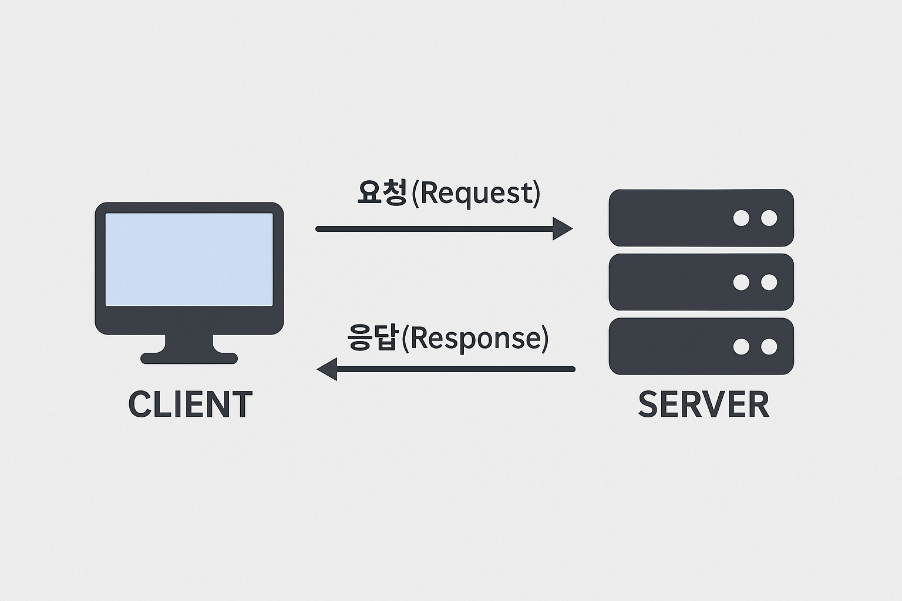

# HTTP란 무엇인가?
## 클라이언트와 서버
HTTP를 시작하기에 앞서, 클라이언트와 서버의 개념을 먼저 알아야합니다.

**클라이언트**는 요청(Request)를 보내는 쪽을 의미하며 웹 관점에서는 브라우저를 의미합니다.

**서버**는 받은 요청에 응답(Response)하는 쪽을 의미하며 일반적으로 데이터를 보내주는 컴퓨터를 의미합니다.

## HTTP란?
HTTP는 Hyper-Text-Transfer-Protocol의 약자로 OSI 7계층 중 **응용 계층**에 속하는 **프로토콜**입니다.

HTTP는 간단히 말하면,
 
웹에서 서버와 브라우저가 데이터를 주고 받기 위한 통신 규칙을 말합니다.

## HTTP의 특징
### 1. 클라이언트-서버 구조이다.

클라이언트가 서버로 리소스를 요청을 하고, 서버가 그 요청을 받으면 리소스를 응답으로 돌려주는 것을 클라이언트-서버 구조라고 합니다.

### 2. Stateless (무상태성)
서버가 클라이언트한테 요청을 받아서 응답을 한 뒤에는 **이전 요청을 기억하지 않는 것**을 Stateless라고 합니다.

HTTP의 이런 Stateless(무상태) 특성은 서버 설계를 단순하게 만들어서 확장성이 있게 하지만, 사용자를 기억해야 하는 작업(예: 로그인)에는 **쿠키 등 다른 방법을 사용**해서 이를 보완합니다.

### 3. 비연결성 (Connectionless)
클라이언트가 서버에 요청을 보낸 후, 서버는 응답을 보낸 뒤 연결을 종료하는 특징을 비연결성(Connectless)이라고 합니다.

그래서 이전 요청과 다음 요청이 서로 관련이 없고, 각 요청이 독립적으로 처리됩니다.
## Header / Body

### Header
**HTTP 요청/응답에 대한 부가 정보**를 전달합니다.
 
클라이언트나 서버가 무엇을 보내고 받는지, 어떻게 처리해야 할지를 알려줍니다.

### Body
요청이다 응답의 **실제 데이터**를 담는 공간입니다.
 
여기에는 로그인 정보, JSON, HTML 등이 있습니다.

## HTTP 메서드
클라이언트가 서버에 서버가 수행해야 할 동작을 지정하는 요청을 보내는 방법을 **HTTP 메서드**라고 합니다.

### 주요 메서드
- GET : 서버에 있는 리소스(데이터)를 가져오기 위한 요청을 합니다.
- POST : 서버에 새로운 데이터를 생성합니다.
- PUT : 기존 데이터를 변경(수정) 또는 새로 생성을 합니다.
- PATCH : PUT과 비슷하지만, 서버의 있는 리소스의 일부 속성만 변경할 때 사용합니다.
- DELETE : 데이터 삭제를 요청합니다.

### 기타 메서드
- HEAD : GET과 거의 같지만, Body(본문)을 반환하지 않습니다. 주로 리소스가 존재하는지 확인하거나, 파일 크기 등 헤더의 정보만 필요할 때 사용합니다.
- OPTIONS : 특정 URL이 어떤 HTTP 메서드를 지원하는지 서버에 물어봅니다.
- CONNECT : 서버에 터널링 연결을 요청하는 메서드입니다. 주로 클라이언트가 중간 프록시 서버를 통해 대상 서버와 암호화된 터널을 만들고 싶을 때 사용합니다.
- TRACE : 클라이언트가 보낸 요청이 서버에 어떻게 도착했는지를 그대로 반환합니다. 주로 디버깅 용도로 사용됩니다.

## HTTP 상태 코드
클라이언트의 요청에 대한 서버의 응답에 관한 정보를 **HTTP 상태 코드**라고 합니다.

상태 코드를 통해 무슨 에러가 발생했는지 알 수 있으므로 에러 핸들링에 매우 도움이 됩니다.

( HTTP 상태 코드는 너무 많아서 복사 붙여넣기 하고 내용 조금만 수정했습니다 ㅠ )

### 200번대: 성공
- 200 : GET 요청에 대한 성공을 나타냅니다.
- 201: 정상적으로 생성이 되었다는걸 나타냅니다.
 
(회원가입 등에서 사용)
- 204 : No Content. 성공했으나 응답 본문에 데이터가 없을 때 나타납니다.
- 205 : Reset Content. 성공했으나 클라이언트의 화면을 새로 고침하도록 권고하는것을 나타냅니다.
- 206 : Partial Conent. 성공했으나 일부 범위의 데이터만 반환됐음을 의미합니다.

### 300번대: 리다이렉션
300번대의 상태 코드는 대부분 클라이언트가 이전 주소로 데이터를 요청하여 서버에서 새 URL로 리다이렉트를 유도하는 경우입니다.

- 301 : Moved Permanently, 요청한 자원이 새 URL에 존재함을 나타냅니다.
- 303 : See Other, 요청한 자원이 임시 주소에 존재함을 나타냅니다.
- 304 : Not Modified, 요청한 자원이 변경되지 않았음을 나타냅니다.

### 400번대: 클라이언트 에러
400번대 상태 코드는 대부분 클라이언트의 코드가 잘못된 경우입니다.

- 400 : Bad Request, 잘못된 요청의 경우 나타납니다.
- 401 : Unauthorized, 권한 없이 요청 또는 Authorization 헤더가 잘못된 경우 나타납니다.
- 403 : Forbidden, 서버에서 해당 자원에 대해 접근 금지일때 나타납니다.
- 404 : Not Found, 요청한 자원이 서버에 존재하지 않거나 없는 url 혹은 존재하지 않는 api를 가지고 요청했을때 나타납니다.
- 405 : Method Not Allowed, 허용되지 않은 요청 메서드일때 나타납니다.
- 409 : Conflict, 최신 자원이 아닌데 업데이트하는 경우에 나타납니다.

### 500번대: 서버 에러
- 501 : Not Implemented, 요청한 동작에 대해 서버가 수행할 수 없는 경우를 나타냅니다.
- 503 : Service Unavailable, 서버가 과부하 또는 유지 보수로 내려간 경우를 나타냅니다.

## 참조한 사이트들
[벨로그](https://velog.io/@wnsdnjs70/HTTP%EB%9E%80)
 
[Inpa](https://inpa.tistory.com/entry/WEB-%F0%9F%8C%90-HTTP-%EB%A9%94%EC%84%9C%EB%93%9C-%EC%A2%85%EB%A5%98-%ED%86%B5%EC%8B%A0-%EA%B3%BC%EC%A0%95-%F0%9F%92%AF-%EC%B4%9D%EC%A0%95%EB%A6%AC)
 
[벨로그2](https://velog.io/@dnjscksdn98/HTTP-%ED%94%84%EB%A1%9C%ED%86%A0%EC%BD%9C%EC%97%90-%EB%8C%80%ED%95%98%EC%97%AC)
 
[Toss개발자센터](https://docs.tosspayments.com/resources/glossary/http-protocol)
 
[티스토리](https://blueyikim.tistory.com/1999)