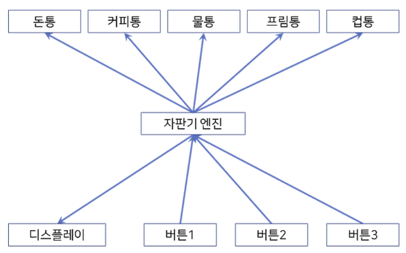
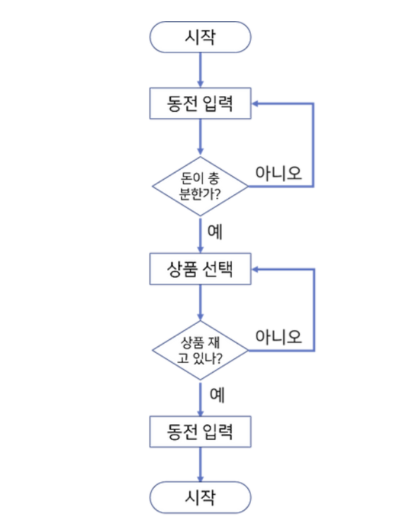

# Java
## 객체지향
객체지향은 프로그램을 여러개의 독립된 단위인 객체들의 모임을 뜻합니다.

객체지향(Java, C# 등)은 절차지향(C 언어 등)과 장단점이 확실히 구분이 됩니다.

### 자판기를 객체지향으로 나타낸다면

### 자판기를 절차지향으로 나타낸다면

### 객체지향의 장점
- 다른 사람이 만든 클래스를 가져오거나, 기존 클래스를 확장하여 새로운 기능을 추가할 수 있기 때문에 **코드 재사용이 용이합니다.**
-  객체 별로 어디 부분에서 결함이 일어났는지 파악하기가 쉽기 때문에 **유지보수가 쉽습니다.**
### 객체지향의 단점
- 각 객체를 참고하기 때문에 **처리 속도가 절차지향에 비해 상대적으로 느립니다.**
- 객체 하나마다 데이터를 저장을 해줘야 하므로 **객체가 많으면 데이터 용량이 많이 커집니다.**
- **설계시 많은 노력과 시간이 필요합니다.**

## 기초 문법
### 원시 자료형
int, string, boolean과 같이 **고정된 저장 공간을 차지하고 하나의 변수마다 하나의 데이터만 담을 수 있는 것**을 원시 자료형이라고 합니다.
### 참조 자료형
배열, 객체, 함수와 같이 **데이터를 직접 저장하는 것이 아니라, 메모리 위치를 가리키는 주소를 저장하는 것**을 참조 자료형이라고 합니다.
